 

## About

D3 Informatics Management graduate focused on **full-stack development**, database-driven applications, and REST API integration. Most of my work lives in **private repositories**; this profile shows selected public work and the tools I use.

<b>More details</b>

 

| | |
|---|---|
| Working on | Web and mobile apps with Laravel, React, and Kotlin |
| Learning | System integration, API design, clean architecture |
| Based in | Kediri, East Java |

## Tech Stack

<!--  -->

## Focus Areas

## Activity

  

<picture>
  <source media="(prefers-color-scheme: dark)" srcset="https://raw.githubusercontent.com/chyntiawindyhapsari/chyntiawindyhapsari/output/github-snake-dark.svg" />
  <source media="(prefers-color-scheme: light)" srcset="https://raw.githubusercontent.com/chyntiawindyhapsari/chyntiawindyhapsari/output/github-snake.svg" />
  
</picture>

 

